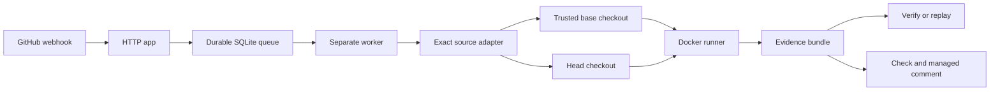

# PatchProof


PatchProof gives maintainers replayable evidence for a pull request that claims to fix a bug. It runs one trusted reproduction against the base and head revisions, records what happened, and publishes the result as a GitHub Check and one managed pull request comment.

A PASS has a narrow meaning: the trusted scenario produced the configured expected failure on base, passed on head, and produced complete evidence. A hash provides integrity for the bundle. It does not identify a signer or provide remote attestation.

## Five-minute local quickstart

Requirements are Node.js 22 or newer and pnpm 11.16.0. Docker is the production backend. The deterministic fixture below opts into the local process backend so it can run without Docker.

```text
pnpm install --frozen-lockfile
pnpm build
pnpm patchproof -- --help
pnpm patchproof validate fixtures/pass/.patchproof.yml
pnpm patchproof run fixtures/pass/.patchproof.yml --base fixtures/pass/base --head fixtures/pass/head --backend local --allow-unsafe-local --output work/pass
pnpm patchproof verify work/pass/patchproof.evidence.json
pnpm patchproof replay work/pass/patchproof.evidence.json
```

The local backend is unsafe and must be named explicitly. A production run uses the configured Docker image and refuses to fall back to a host process. `pnpm test:e2e` runs the fixture sequence, tamper check, replay plan, and outcome matrix.

Example output from a real fixture run is kept in [`docs/examples/terminal-pass.txt`](docs/examples/terminal-pass.txt):

```text
PatchProof PASS - The trusted scenario failed on base and passed on head.
Scenario   parser-regression (parser-regression)
Comparison
  BASE  fail        exit=1       64ms
  HEAD  pass        exit=0       61ms
Evidence   schema=1 sha256=4341d958d8423925... artifacts=4
Policy     backend=local network=none trusted-config=base
Replay     patchproof replay patchproof.evidence.json --yes --base <base-dir> --head <head-dir>
```

## How the product is split



- `packages/core` owns the versioned evidence model, canonical JSON, SHA-256 integrity, redaction, state classification, and policy decisions.
- `packages/config` parses `.patchproof.yml`, validates semantics, and keeps executable configuration on the trusted base side of the boundary.
- `packages/runner` copies clean revisions and runs the identical argv through Docker. The local process backend exists for explicit development and test use.
- `packages/cli` provides `init`, `validate`, `run`, `verify`, `replay`, and `doctor` through the `patchproof` binary.
- `packages/report` renders terminal and Markdown output. `packages/github` keeps Checks, comments, commands, and webhook signatures testable without credentials.
- `apps/github-app` contains the webhook process, SQLite run state, durable queue, exact-ref source adapter, and separate worker process. The HTTP process never executes repository code.
- `packages/testkit` and `fixtures/` provide deterministic fail-to-pass, failure, timeout, policy, malformed-config, tamper, and redaction cases.

For a local GitHub App deployment, start the two processes with the same `PATCHPROOF_SQLITE_PATH`:

```text
pnpm --filter @patchproof/github-app start:webhook
pnpm --filter @patchproof/github-app start:worker
```

The webhook process verifies HMAC signatures, authorizes commands, creates the queued Check and managed comment, and inserts a job. The worker claims leases, fetches the exact base and head SHAs, loads `.patchproof.yml` from base, runs the trusted scenario, writes the bundle, and updates the same GitHub IDs.

## Security model

Pull request content, comments, configuration, logs, archives, and GitHub API responses are untrusted. Fork metadata is handled fail-closed. The worker keeps the GitHub token in the source-fetch process and never passes it to an execution container. The scenario sees only explicit environment values. Launcher variables such as host `PATH` and `SystemRoot` are omitted from evidence and represented by key and hash metadata.

Docker runs with network disabled by default, a numeric non-root user, dropped capabilities, `no-new-privileges`, read-only root where configured, CPU, memory, PID, timeout, and output limits, and explicit writable scratch space. Executed containers receive no Docker socket or host secret mount. Commands use argv arrays with `shell: false`. Artifact verification rejects traversal, absolute paths, and symlink escapes.

Logs are redacted as streams before output limits are applied. `patchproof verify` performs strict recursive schema validation, checks cross-references and artifact hashes, recomputes the deterministic outcome, and never executes repository code.

See [SECURITY.md](SECURITY.md) and [docs/threat-model.md](docs/threat-model.md) for the threat model and residual risks.

## Current limitations

- Docker integration depends on a Docker CLI and daemon. This environment does not provide Docker, so the Docker integration test is present but reports its unavailable status rather than passing silently.
- The local process backend is not an isolation boundary and is never the production default.
- Credential-based GitHub validation is documented but tests use offline fakes and a local HTTP fixture.
- Node's built-in `node:sqlite` API is experimental in the supported Node line.
- Replay requires `--base` and `--head` source directories because bundles store stable labels instead of host paths and do not contain full source snapshots.
- Network allowlists are refused until an enforcing adapter is supplied. The current Docker path supports network `none` only.

## Roadmap

1. Add optional signed evidence envelopes with explicit signer identity semantics.
2. Pin and verify OCI image digests in the runner policy.
3. Add a remote evidence store with retention controls.
4. Add installation health reporting and a small historical run index.

## Contributing

Read [CONTRIBUTING.md](CONTRIBUTING.md), then run `pnpm format:check`, `pnpm lint`, `pnpm typecheck`, `pnpm test`, `pnpm test:e2e`, `pnpm build`, and `pnpm docs:check`. Security-sensitive changes should include a regression test and a threat-model update. The contributor and release guides are in [docs](docs/).

## License

PatchProof is available under the [Apache License 2.0](LICENSE).
