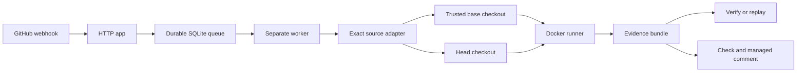

<div align="center">


# PatchProof

**Replayable proof that a bug fails before the patch and passes after it.**

[](https://github.com/kwlck/PatchProof/actions/workflows/ci.yml)
[](https://github.com/kwlck/PatchProof/actions/workflows/codeql.yml)
[](https://nodejs.org/)
[](https://pnpm.io/)
[](LICENSE)

One trusted reproduction. Two exact revisions. One evidence bundle.

|  Base revision   | Head revision | PatchProof result |
| :--------------: | :-----------: | :---------------: |
| Expected failure |     Pass      | Verified evidence |

[Install](#one-command-install) В· [Evidence](#evidence-at-a-glance) В· [Architecture](#how-the-product-is-split) В· [Security](#security-model) В· [Docs](#documentation) В· [Roadmap](#roadmap)

</div>

## Why PatchProof

A pull request that claims to fix a bug usually comes with a screenshot or a sentence. PatchProof replaces that with something stronger: it runs **one trusted reproduction**, loaded from the base revision, against both the base and head revisions, records everything, and publishes the result as a GitHub Check plus one managed pull-request comment.

A PASS has a narrow meaning: the trusted scenario produced the configured expected failure on base, passed on head, and produced complete evidence. A hash provides integrity for the bundle. It does not identify a signer or provide remote attestation.

## One-command install

macOS or Linux:

```text
curl -fsSL https://raw.githubusercontent.com/kwlck/PatchProof/main/install/install.sh -o install-patchproof.sh
bash install-patchproof.sh
```

Windows PowerShell:

```powershell
Invoke-WebRequest https://raw.githubusercontent.com/kwlck/PatchProof/main/install/install.ps1 -OutFile install-patchproof.ps1
powershell -ExecutionPolicy Bypass -File .\install-patchproof.ps1
```

The installer verifies every download against published SHA-256 checksums, installs Node.js 22 automatically when no suitable Node is present, places the standalone `patchproof` executable on PATH, and finishes with an environment check. Nothing else is required to try PatchProof:

```text
patchproof setup --demo
```

That single command runs a self-contained bug scenario against two revisions, writes the evidence bundle, verifies it, and prints next steps in about 30 seconds. Production runs use Docker; install it from [Docker Desktop](https://www.docker.com/products/docker-desktop/) whenever you are ready. Installers resolve the latest GitHub Release, so create a release first or pin `PATCHPROOF_VERSION=<tag>`.

## Run from source

Contributors and anyone evaluating against a checkout run PatchProof from source with pnpm. The step-by-step sequence lives in [docs/quickstart.md](docs/quickstart.md), and the day-to-day development workflow, including every required check, lives in [CONTRIBUTING.md](CONTRIBUTING.md). Users should prefer the one-command install above.

## Real terminal output

Example output from a real fixture run is kept in [`docs/examples/terminal-pass.txt`](docs/examples/terminal-pass.txt):

```text
PatchProof PASS - The trusted scenario failed on base and passed on head.
Scenario   parser-regression (parser-regression)
Comparison
  BASE  fail        exit=1       64ms
  HEAD  pass        exit=0       61ms
Evidence   schema=1 sha256=4341d958d8423925... artifacts=4
Policy     backend=local network=none trusted-config=base
Replay     patchproof replay patchproof.evidence.json --yes --base <base-dir> --head <head-dir>
```

## Evidence at a glance

Every run writes a versioned bundle with canonical JSON, SHA-256 integrity over the whole document, and hashed log artifacts. Values below come from the fixture run above.

```json
{
  "schemaVersion": 1,
  "outcome": "PASS",
  "verdict": "The trusted scenario failed on base and passed on head.",
  "scenario": { "id": "parser-regression", "trustedSource": "base" },
  "policy": { "backend": "local", "network": "none", "trustedConfigRevision": "base" },
  "artifacts": [
    {
      "id": "artifacts_base.stderr.log",
      "relativePath": "artifacts/base.stderr.log",
      "mediaType": "text/plain"
    }
  ],
  "integrity": {
    "algorithm": "sha256",
    "canonicalSha256": "7231d4d12ba37fb72e230ffe015916464a527d12abb8dd94c668eeaf26d8c0c7",
    "signer": null
  }
}
```

`patchproof verify` recomputes all of it without executing repository code, and `patchproof replay` re-runs the recorded scenario against operator-supplied source directories.

## How the product is split



| Package            | Role                                                                                                |
| ------------------ | --------------------------------------------------------------------------------------------------- |
| `packages/core`    | Versioned evidence model, canonical JSON, SHA-256 integrity, redaction, classification              |
| `packages/config`  | `.patchproof.yml` parsing, semantic validation, trusted-base executable configuration               |
| `packages/runner`  | Clean revision copies, identical argv through Docker, explicit local development backend            |
| `packages/cli`     | `init`, `validate`, `run`, `verify`, `replay`, `doctor`, and `setup` behind the `patchproof` binary |
| `packages/report`  | Terminal and Markdown rendering                                                                     |
| `packages/github`  | Checks, managed comments, slash commands, webhook signatures without credentials                    |
| `apps/github-app`  | Webhook process, SQLite run state, durable queue, exact-ref adapter, separate worker                |
| `packages/testkit` | Deterministic fail-to-pass, failure, timeout, policy, tamper, and redaction cases                   |

The HTTP process never executes repository code. For a local GitHub App deployment, start the two processes with the same `PATCHPROOF_SQLITE_PATH`:

```text
pnpm --filter @patchproof/github-app start:webhook
pnpm --filter @patchproof/github-app start:worker
```

The webhook process verifies HMAC signatures, authorizes commands, creates the queued Check and managed comment, and inserts a job. The worker claims leases, fetches the exact base and head SHAs, loads `.patchproof.yml` from base, runs the trusted scenario, writes the bundle, and updates the same GitHub IDs.

## Security model

Pull request content, comments, configuration, logs, archives, and GitHub API responses are untrusted.

**Execution isolation**
Docker runs argv arrays with no shell, network disabled by default, a numeric non-root user, dropped capabilities, `no-new-privileges`, read-only root where configured, CPU, memory, swap, PID, timeout, and output limits, and explicit writable scratch space. Executed containers receive no Docker socket and no host secret mount. Commands never pass through a shell.

**Untrusted input handling**
Fork metadata fails closed. Executable configuration always comes from the trusted base revision. Artifact verification rejects traversal, absolute paths, symbolic links, and special files. Outcome recomputation evaluates configured patterns under a wall-clock deadline, so catastrophic regular expressions fail verification instead of blocking it.

**Secret containment**
The worker keeps installation tokens in its source-fetch process and never passes them to an execution container. Scenario environment values travel through a private env file instead of process arguments. Launcher variables such as host `PATH` are omitted from evidence and represented by key and hash metadata. Logs are redacted as streams before output limits are applied.

**Verifiable evidence**
`patchproof verify` performs strict recursive schema validation, checks cross-references and artifact hashes, recomputes the deterministic outcome, and never executes repository code.

See [SECURITY.md](SECURITY.md) and [docs/threat-model.md](docs/threat-model.md) for the threat model and residual risks.

## Documentation

| Guide                                                      | Covers                                        |
| ---------------------------------------------------------- | --------------------------------------------- |
| [Quickstart](docs/quickstart.md)                           | First local run, step by step                 |
| [CLI reference](docs/cli-reference.md)                     | Every command, flag, and exit code            |
| [Configuration reference](docs/configuration-reference.md) | `.patchproof.yml` fields and limits           |
| [Evidence format](docs/evidence-format.md)                 | Bundle schema, integrity, and artifacts       |
| [Replay model](docs/replay-model.md)                       | What replay proves and what it asks of you    |
| [Architecture](docs/architecture.md)                       | Process boundaries and design decisions       |
| [Deployment](docs/deployment.md)                           | Production processes, variables, and ceilings |
| [GitHub App setup](docs/github-app-setup.md)               | App registration, permissions, events         |
| [Manual validation](docs/github-app-validation.md)         | Protected credential validation procedure     |
| [Threat model](docs/threat-model.md)                       | Adversaries, controls, residual risks         |
| [Troubleshooting](docs/troubleshooting.md)                 | Outcomes, errors, and recovery                |
| [Contributor guide](docs/contributor-guide.md)             | Day-to-day development workflow               |

## Current limitations

- Docker integration depends on a Docker CLI and daemon. CI runs it against real containers; when run without Docker, the test reports its unavailable status rather than passing silently.
- The local process backend is not an isolation boundary and is never the production default.
- Credential-based GitHub validation runs on demand as a protected manual workflow against the real GitHub API; unit tests use offline fakes and a local HTTP fixture.
- Node's built-in `node:sqlite` API is experimental in the supported Node line.
- Replay requires `--base` and `--head` source directories because bundles store stable labels instead of host paths and do not contain full source snapshots.
- Network allowlists are refused until an enforcing adapter is supplied. The current Docker path supports network `none` only.

## Roadmap

- [ ] Add optional signed evidence envelopes with explicit signer identity semantics.
- [ ] Add a remote evidence store with retention controls.
- [ ] Add installation health reporting and a small historical run index.

## Contributing

Read [CONTRIBUTING.md](CONTRIBUTING.md), then run:

```text
pnpm format:check
pnpm lint
pnpm typecheck
pnpm test
pnpm test:e2e
pnpm build
pnpm docs:check
```

Security-sensitive changes should include a regression test and a threat-model update. The contributor and release guides are in [docs](docs/).

<div align="center">

PatchProof is available under the [Apache License 2.0](LICENSE).

</div>
