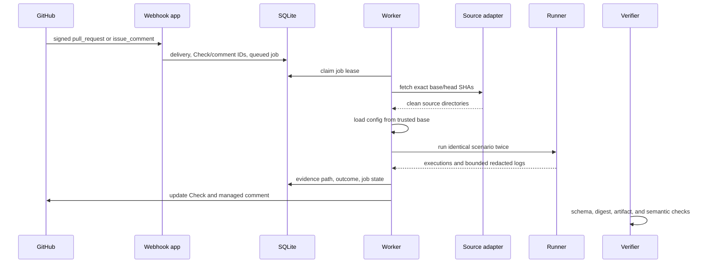

# Architecture

PatchProof has four boundaries:

1. GitHub and pull request content are untrusted input. The webhook process authenticates deliveries, authorizes commands, creates the managed Check and comment, and writes a durable queue job.
2. SQLite stores delivery IDs, managed surface IDs, and job state. Queue leases make retries and stale-worker recovery explicit.
3. A separate worker fetches exact source SHAs and loads `.patchproof.yml` from the base checkout. The webhook process has no runner import and never executes repository code.
4. The runner materializes clean workspaces and executes the same trusted argv for base and head. Docker is the default boundary. The local process backend is an explicit unsafe adapter for development and tests.

The evidence bundle is the handoff between the worker and verifier. Its SHA-256 digest covers canonical version-1 fields and is not a signer identity. `patchproof replay --yes --base <dir> --head <dir>` requires confirmation because it executes code again and reports environmental differences.
